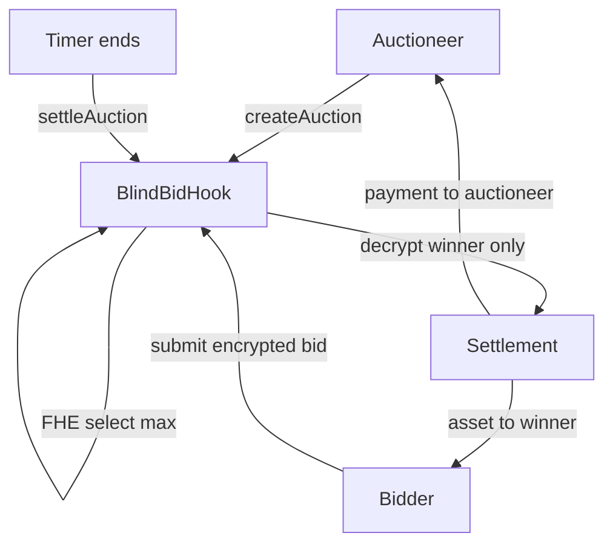
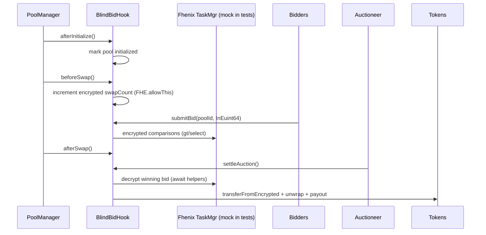

# BlindBid Hook

Encrypted, privacy-preserving NFT/token auctions inside Uniswap v4 pools using Fhenix Fully Homomorphic Encryption (FHE).

## Badges
[](#tests--coverage) [](#tests--coverage) [](#license)

## Description
BlindBid Hook lets pools run sealed-bid auctions where bids stay encrypted end-to-end. The hook handles encrypted bid submission, encrypted max-bid selection, and settlement without revealing losing bids. It leverages Fhenix FHE types (`euint64`, `euint128`, `ebool`) and Uniswap v4 hook callbacks (`afterInitialize`, `beforeSwap`, `afterSwap`).

## Problem Statement
On-chain auctions leak bid amounts, enabling sniping, collusion, and value leakage for sellers. There is no native Uniswap v4 primitive to run privacy-preserving auctions within pools.

## Solution & Impact (incl. financial impact)
- Sealed bids via FHE prevent price discovery gaming and last-block snipes, improving auction fairness.
- Confidential price discovery can lift final clearing prices for sellers (less fear of being picked off), and reduce bidder overpayment risk, driving healthier participation.
- Runs inside AMM pools, so liquidity and settlement stay composable with the rest of Uniswap.

## How it Works (high level)
- Auctioneer lists an asset in a pool and starts an auction window.
- Bidders submit encrypted bids (`InEuint64`) with FHE permissions granted to the hook.
- Hook tracks encrypted maxima with `FHE.gt`/`FHE.select`; losing bids never decrypt.
- On settlement, the hook decrypts only the winning amount, transfers encrypted funds, unwraps, and moves the asset/NFT to the winner.



## Technical Flow (hooks + encryption)


## Architecture & Components
- `BlindBidHook`: main Uniswap v4 hook; manages auctions, FHE comparisons, settlement, and hook lifecycle tracking (`afterInitialize`, `beforeSwap`, `afterSwap`).
- `MockFHERC20`: FHE-enabled mock token for encrypted balances, permissions, unwrap.
- `CoFheTest` utilities: spins up mock Task Manager/Verifier so FHE ops work in tests.
- `HookMiner`, `PoolKey`, `PoolId`: utilities for deriving valid hook addresses and pools.
- Docs: deeper detail in `docs/ARCHITECTURE.md`; security notes in `docs/AUDIT.md`.

## Bidder & Auctioneer Flows (user view)
- Auctioneer: `createAuction(poolKey, bidToken, assetToken, duration)` → approve hook for asset → wait for bids → `settleAuction`.
- Bidder: encrypt bid with signer → `submitBid(poolId, encryptedBid)` → on success, balance is checked in FHE, bid stays hidden → after settlement, either wins asset or no action.

## Hook Callbacks Used
- `afterInitialize`: marks pool as initialized and emits `PoolInitialized`.
- `beforeSwap`: increments encrypted `swapCount` for observability; permissions granted via `FHE.allowThis`.
- `afterSwap`: emits `SwapExecuted`.

## Tests & Coverage
- Command: `forge test --via-ir`
- Coverage target: `forge coverage --via-ir` (aiming for 100% line/function where feasible)
- Current suite: >50 unit/integration-style tests covering lifecycle, permissions, reverts, tie-breakers, and settlement paths. Goal remains 100+ tests spanning unit/integration/invariant buckets.

## Installation & Setup
```bash
# Prereqs: foundryup, pnpm
pnpm install
forge install

# Run tests
forge test --via-ir

# Coverage (target 100%)
forge coverage --via-ir
```

## Usage (core flows)
- Create auction:
```solidity
hook.createAuction(poolKey, bidCurrency, assetCurrency, 1 days);
```
- Submit encrypted bid:
```solidity
InEuint64 memory encBid = encryptBid(1_000, bidderSigner);
hook.submitBid(poolId, encBid);
```
- Settle:
```solidity
hook.settleAuction(poolId);
```

## Demo (local)
1) Spin up local Anvil; deploy `MockFHERC20` and `BlindBidHook` with `forge script script/DeployBlindBidHook.s.sol --rpc-url http://localhost:8545 --broadcast`.
2) Mint encrypted bid tokens to bidders via mock; call `allowHookAccess`.
3) Run `createAuction`, `submitBid` (multiple bidders), then `settleAuction`.
4) Observe events: `BidSubmitted`, `AuctionSettled`, `SwapExecuted`.

## Roadmap
- Expand invariant/property tests to exceed 100 total cases.
- Add mainnet/testnet deployment scripts with canned params and TX examples.
- Gas/UX optimizations for FHE permissioning flows.
- Frontend demo with encrypted bid composer.

## Security
See `docs/AUDIT.md` for security considerations and audit notes.

## License
MIT
